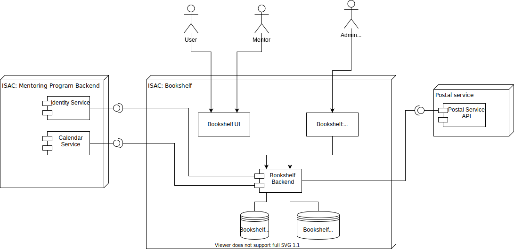

# Preliminary Solution Design

## Brief overview

Bookshelf is a satellite application to ISAC mentoring program that extends its functionality. The goal of the application is to add more learning capabilities for ISAC students and provide a guideline to achieve desired skills using book recommendation guidelines by mentors of ISAC Mentoring program.

Due to cloth relationships with ISAC mentoring program, Bookshelf should avoid functions duplication with main platform and should be integrated with its internal services. Future integrations with external systems (Postal service) are expected and should be taken into account.

From the Architecture point of view the Bookshelf is a client-server application. UI is a web application with additional portal for admin functions. Backend is a monolithic service that is easier to setup and deploy from the start. Due to moderate number of ISAC Students and restricted access for the external users at the start of the project, extension of the backend capacity can be done by vertical scaling. Several instances of the backend can be set up for supporting High availability.

The storage layer of the Bookshelf contains two major parts

- Main Database (any SQL or NoSQL storage engine). The exact engine should be selected on SA level.

- Blob storage for storing media files such as cover images of the books, sample pages, attachments. Any solution with S3 like API is preferable for a soft switch to and from cloud solutions.

The Bookshelf's technology stack is preferable to be the same as in ISAC Mentoring Platform for easy maintenance by the same resources.

## High-Level Architecture

