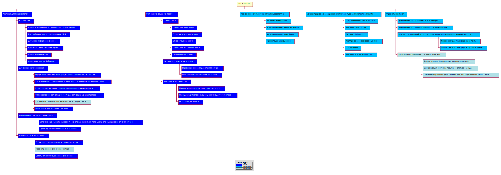

# Bookshelf: Visions and Capabilities

## Visions

- Платформа для экспертной рекомендации литературы.
- Участники менторинг программы могут получать доступ к книгам клуба.
- Библиотека клуба состоит только из книг, которые можно передавать участникам клуба не нарушая лицензионных соглашений.
	- Бумажные книги.
	- Электронные книги по программе совместного доступа.
	- Бесплатне электронные книги в виде ссылок на официальный источник.
- Расширение библиотеки клуба только наиболее релевантными книгами.
- Менторы формируют рекомендуемые списки чтения клуба.

## Capabilities

- Учет книг для пользователей.
	- Каталог книг.
	- Добавление неучтенных книг.
	- Формирование заявки на оценку книги.
	- Просмотр списков  для чтения.
- Учет рекомендаций менторами
	- Оценка книги.
	- Учет списков рекомендаций.
	- Учет заявок на оценку книг.
- Аренда книг из библиотеки клуба пользователями.
	- Заявка на чтение книги.
	- Учет персональных заявок на чтение.
	- Учет персональных доставок/отправок.
	- Пролонгация аренды книги.
- Администрирование аренды книг библиотеки клуба администраторами клуба.
	- Получение списка книг к покупке.
	- Учет состояние закупок.
	- Учет книг библиотеки.
	- Учет доставок/отправок арендованных книг.
	- Списание книг.
	- Учет пролонгаций аренды книг.
- "Удобная логистика"
	- Получение/возврат книг на офлайновых встречах клуба.
	- Получение/возврат книг с помощью сторонних почтовых сервисов.
	- Объединение получений и возвратов книг в пакеты для обработки администратором
	- Интеграция с сторонними почтовыми сервисами.

##

